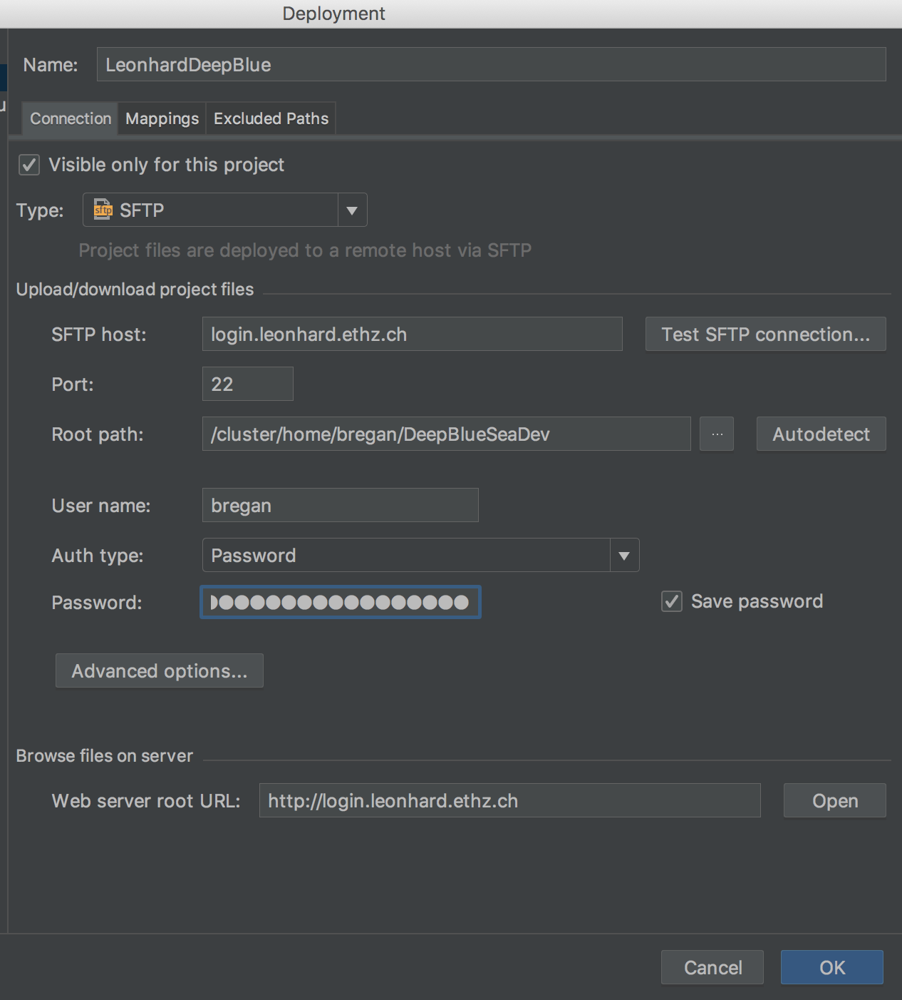
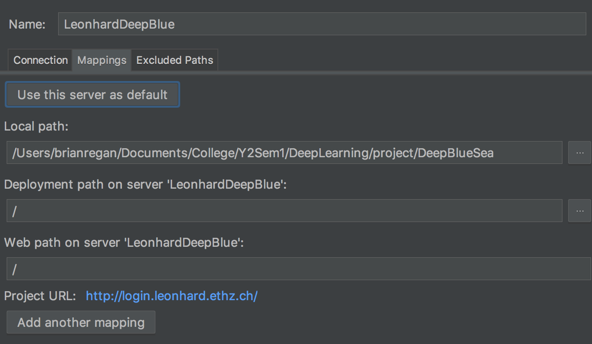
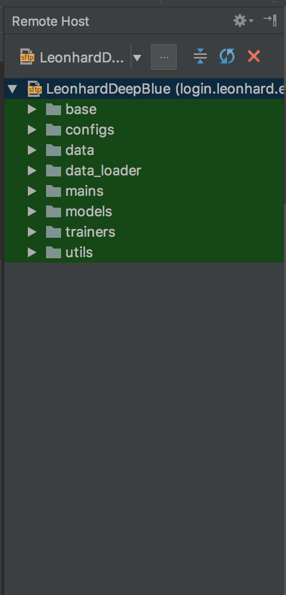
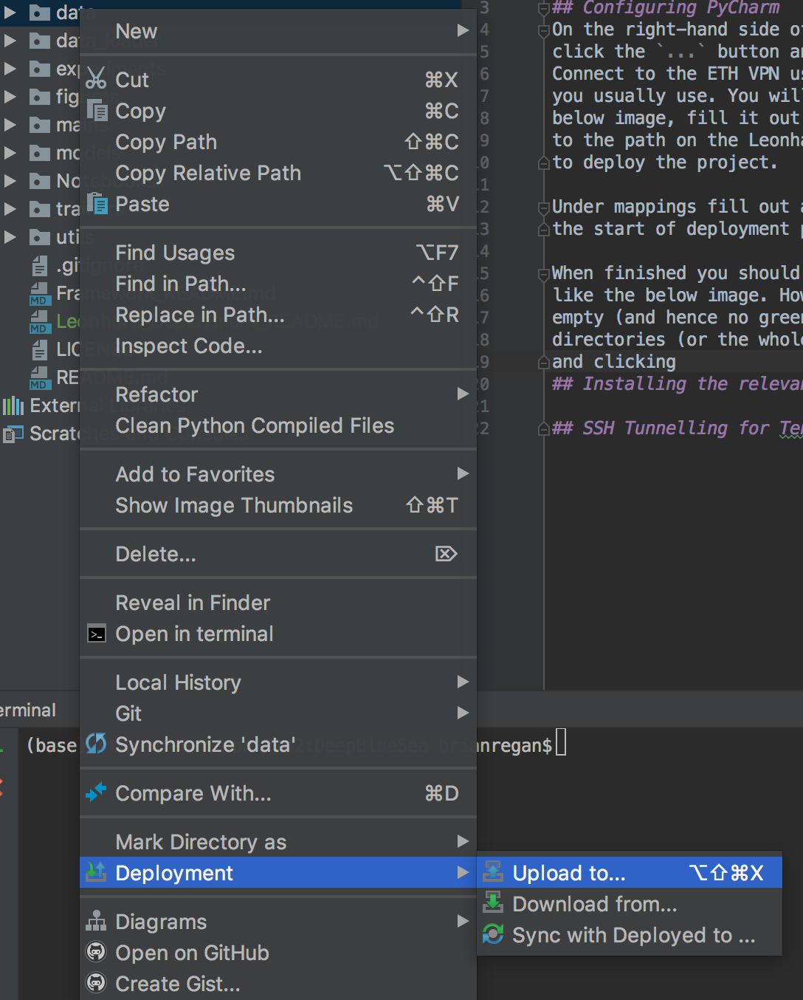

# Tips for Deploying the Model on Leonhard

## Configuring PyCharm
On the right-hand side of your PyCharm terminal under Remote Host 
click the `...` button and `+` to add a new connection. 
Connect to the ETH VPN using whatever VPN client
you usually use. You will get a window like the 
below image, fill it out as below where `Root Path` points
to the path on the Leonhard cluster where you want
to deploy the project. 

Under mappings fill out as below. The  `/` at  
the start of deployment path seems important. 

When finished you should get a window on the right
like the below image. However, it'll likely be
empty (and hence no green). 

Start right clicking
directories (or the whole directory) on the left
and clicking `upload to` to upload them to the server.

## Installing the relevant libraries
ssh into leonhard by typing `ssh <username>@login.leonhard.ethz.ch`
(rememember you need to be using a VPN or be 
connected to ETH wifi).

To install the tensorflow and python gpu run the 
command `module load gcc/6.3.0 python_gpu/3.6.4`. This
loads the main libraries (numpy, tensorflow etc.) required.
Note, next time you login to leonhard you'll need
to run this command again.

To install other libraries not covered (eg. boost 
is used in the project I think), one solution is
to run the code interactively (add a `-I` to 
you bjobs submission) until it returns an import 
error and the run pip install for that library.
To pip install a library on Leonhard you need to 
run `pip install --user <library>`. These installs
persist over login sessions.

## SSH Tunnelling for Tensorboard
To view the remote results of the model on tensorboard 
we need to SSH tunnel to send the tensorboard outputs
back to our machine. 

Open a new terminal and connect to Leonhard but this
time adjust you login to say 
`ssh -L 9000:localhost:9000 <username>@login.leonhard.ethz.ch`. 
The `-L` adds ssh options and the `9000:localhost:9000` sends
the results of port 9000 on the node you connect to 
to your port 9000. However, we need to run tensorboard as a 
bjob and so it will be deployed to yet another machine
and so we have to expand the tunnel once more.

The first step is to run tensorboard. On another terminal
 (not the one you tunnelled with), ssh into leonhard 
 normally and ype some version of
`bsub -I -R "rusage[mem=10000, ngpus_excl_p=1, ] tensorboard --logdir=<relevant_directory>`.
Once the job starts you'll get a job ID. Back in the tunnel
ssh type `bjob_connect <job_id> -L 9000:localhost:6006`. This will connect
to the node on which tensorboard is operating and 
send the results of its port 6006 (to which tensorboard
writes to) to the login nodes 9000 port which sends it
to your port 9000. More info on `bjob_connect` [here](http://localhost:8888).
On your web browser `http://localhost:9000` 
should (hopefully) resolve to tensorboard.

Some points of note:

- 9000 was just picked as it works. Other numbers work but
several ports are blocked. Takes a bit of experimenting.

- Tensorboard default writes to 6006 but if you want to 
enforce a port to make things clearer you can add `--port=6006` 
to the tensorboard command after `--logdir=<relevant_dir>`.

